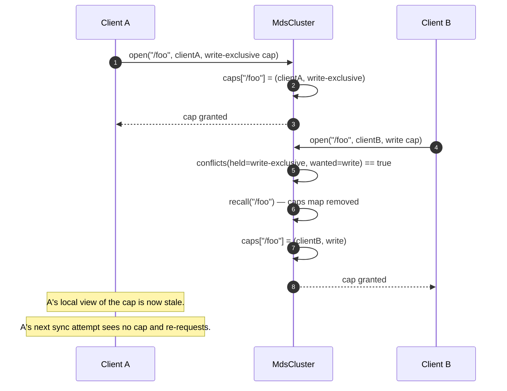

# MDS Capability Recall

> Last reconciled with the repo on 2026-05-20.
>
> What happens when two clients want conflicting access to the same file: the MDS recalls the existing capability from the current holder before granting the new request.

## 1. Why this flow exists

CephFS's MDS is fast (compared to GFS-class single-master systems) because clients aggressively cache file metadata under the protection of capabilities. The cost: when a second client wants conflicting access, the MDS has to synchronously recall the first client's cap. This flow shows the in-code shape of that synchronisation, including the conflict-detection check that gates whether recall is needed at all.

## 2. Sequence



## 3. Step-by-step walkthrough

1. **Client A opens with a write-exclusive cap.** `MdsCluster.open("/foo", "clientA", capWriteExclusive)`. Inside the synchronized method, the MDS finds no existing cap for `/foo` → registers `(clientA, capWriteExclusive)` in the `caps` map.

2. **Client B opens with a conflicting cap.** Same method, different requester. Inside the synchronized block:
   - Existing cap holder is `clientA` (different from `clientB`).
   - `conflicts(held=capWriteExclusive, wanted=capWrite)` returns true — see §4 for the conflict matrix.
   - MDS calls `recall("/foo")` — removes the map entry.
   - Then registers `(clientB, capWrite)`.
   - Returns the new cap to client B.
   *File:* `dfs-mds/.../MdsCluster.java#open`.

3. **Client A's next access detects the missing cap.** `heldBy("/foo", "clientA")` returns `Optional.empty()` because the map entry was removed by `recall`. Client A re-requests; the conflict cycle can repeat.

## 4. The conflict matrix

```java
private boolean conflicts(CapabilityVector held, CapabilityVector wanted) {
    return held.hasExclusive() || wanted.hasExclusive() || wanted.hasWrite() || held.hasWrite();
}
```

The check is symmetric: a write OR an exclusive bit on EITHER side triggers recall. Two pure-read caps coexist; everything else conflicts. This is intentionally pessimistic — in a teaching demo, we'd rather over-recall than risk silent staleness.

| Held cap | Wanted cap | Conflicts? |
|---|---|---|
| read | read | no |
| read | write | yes |
| read | exclusive | yes |
| write | read | yes |
| write | write | yes |
| write | exclusive | yes |
| exclusive | anything | yes |
| anything | exclusive | yes |

## 5. Failure modes

| Step | Failure | Behaviour |
|---|---|---|
| 1 | Same client re-opens with a stronger cap | No conflict (same `clientId`); the existing entry is just overwritten |
| 2 | Recall called for an unknown path | No-op; the map just doesn't contain the key |
| 3 | Client A holds the cap but is unreachable | This module's `recall` is synchronous (just a map remove); a real MDS would send a recall RPC and have to time out unreachable clients |

## 6. Stubs

The wiki's cap-recall flow includes:

- **A network round-trip** to the holder, with deadline. Here, the recall is a local map remove.
- **A forced flush** of dirty writes from the holder back to the OSDs before the cap is released. Here, there are no writes to flush.
- **Cap downgrade**: in CephFS, the MDS often downgrades the held cap (e.g. write-exclusive → write-shared) rather than removing it. This module's recall always removes; the downgrade nuance isn't modeled.

## 7. Related

- [`modules/dfs-mds.md`](../modules/dfs-mds.md)
- Wiki: [`concepts/capability-vector`](https://github.com/hemantkgupta/CSE-Raw/blob/main/wiki/concepts/capability-vector.md), [`systems/cephfs-mds`](https://github.com/hemantkgupta/CSE-Raw/blob/main/wiki/systems/cephfs-mds.md)
