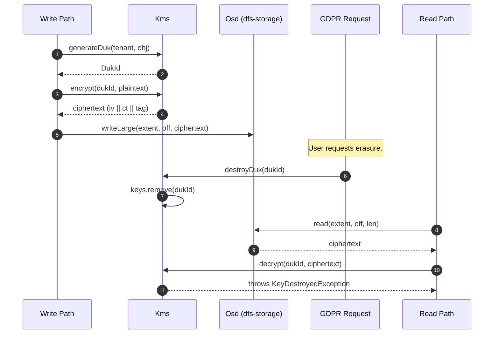

# Crypto-Shredding for GDPR Erasure

> Last reconciled with the repo on 2026-05-20.
>
> Why "delete the user's data" on an erasure-coded immutable backend is impossible without crypto-shredding — and how the teaching KMS demonstrates the pattern.

## 1. Why this flow exists

GDPR right-to-be-forgotten requires the data controller to make a user's data unreadable on demand. On a cluster file system using wide-stripe erasure coding plus immutable append-only extents, physically rewriting the user's bytes is operationally infeasible: the bytes are spread across many shards on many disks, the EC parities span them, and rewrite would invalidate the parity. The pattern that solves this is **crypto-shredding**: every user's data is encrypted with a per-user Data Unique Key; deletion is "destroy the key". After key destruction, the ciphertext is mathematically unrecoverable.

## 2. Sequence

## 3. Step-by-step walkthrough

1. **At write time, encrypt the plaintext.** A write path (in this repo, this would happen in `NodeApi.put` if you wired it up) calls `kms.generateDuk(tenant, obj)` for a per-object DUK on first write, then `kms.encrypt(dukId, plaintext)`. The returned bytes are `iv || ciphertext || gcmTag` — 12 + n + 16 bytes.

2. **Store the ciphertext.** The OSD's `writeLarge` receives the ciphertext bytes. From the OSD's perspective, this is just an opaque blob; the OSD has no insight into whether the bytes are encrypted, plain, or partially encoded.

3. **At read time, fetch and decrypt.** `osd.read(extent, off, len)` returns the bytes; the read path looks up the DukId from object metadata (in a real system, the mapping `(tenant, obj) → DukId` would be stored alongside the object) and calls `kms.decrypt(dukId, ciphertext)`. Plaintext returned to the caller.

4. **GDPR erasure request.** `kms.destroyDuk(dukId)`. The KMS removes the key from its in-memory map. From this moment forward, no decryption is possible: the bytes on disk are intact, but the AES-GCM key is gone.

5. **Subsequent read attempts fail.** Any future `decrypt(dukId, ...)` call throws `KeyDestroyedException`. The OSD continues to serve the bytes (it doesn't know the bytes are now garbage); only the decryption boundary catches the deletion.

## 4. Failure modes

| Step | Failure | Behaviour |
|---|---|---|
| 1 | Tenant/object combination never had a DUK | `decrypt` on the dummy id throws (no key in the map) |
| 1 | Encrypt called on a destroyed DUK | Throws — defense-in-depth |
| 2 | OSD checksum corrupts the ciphertext | On read, AES-GCM tag check fails → exception |
| 4 | DestroyDuk called twice | Idempotent (second call is a no-op on an absent map entry) |
| 4 | Background process re-encodes the ciphertext for tier transition | The bytes are still ciphertext; the encoding is transparent; key destruction still works |

## 5. Why this pattern fits immutable EC storage

The wiki page [`concepts/key-shredding`](https://github.com/hemantkgupta/CSE-Raw/blob/main/wiki/concepts/key-shredding.md) describes it as the only practical approach for:

- **Append-only logs** — rewriting old entries to remove a user's data would break log integrity.
- **Wide-stripe EC** — overwriting shards invalidates parities across the stripe.
- **Cold archival tiers** — the data may be on tape or in an offline format; "delete" the key is the only operation available without round-tripping.

The trade is that compliance demonstrates "we destroyed the key", not "we zeroed the bytes". For most regulatory regimes (GDPR included) this is accepted because the key destruction is verifiable and immediate.

## 6. The teaching gap

This repo's `dfs-security.Kms` is the cryptographic primitive in real form (AES-GCM, 96-bit IV, 128-bit tag). What's missing for an end-to-end demo:

- **Wiring into `dfs-storage.Osd`** — no module currently encrypts on write or decrypts on read.
- **The `(tenant, object) → DukId` mapping** — would belong in object metadata, e.g. an `EncryptedObject` value class.
- **Envelope encryption** — production schemes wrap per-object DUKs with a master key. The repo's KMS conflates the layers.
- **Audit logging** — a real KMS logs every encrypt / decrypt / destroy.

## 7. Related

- [`modules/dfs-security.md`](../modules/dfs-security.md)
- Wiki: [`concepts/key-shredding`](https://github.com/hemantkgupta/CSE-Raw/blob/main/wiki/concepts/key-shredding.md)
