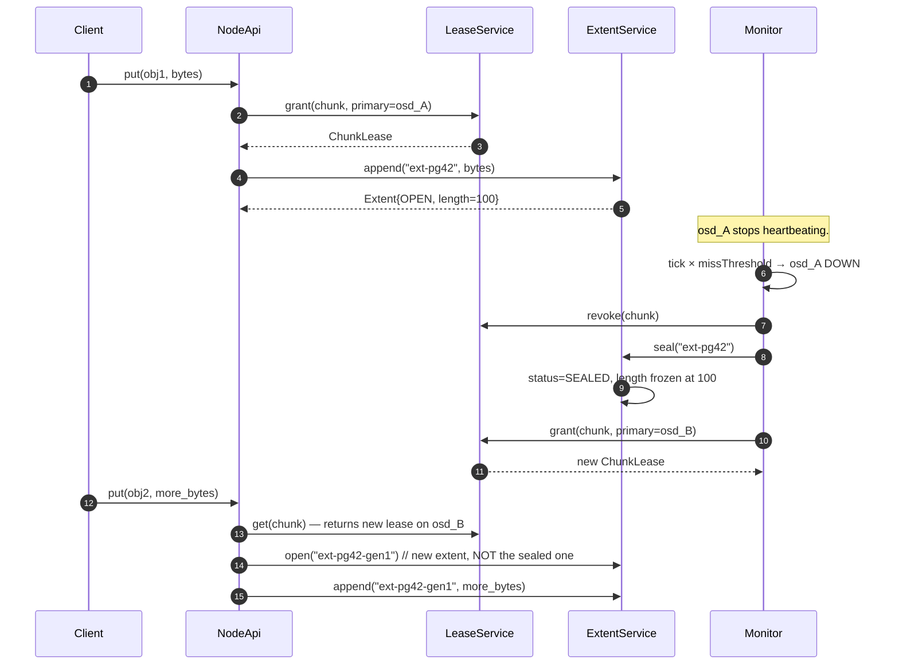

# Extent Sealing on Primary Failure

> Last reconciled with the repo on 2026-05-20.
>
> What happens when an open extent's primary OSD becomes unreachable: the extent is sealed at its last universally-committed length, future writes roll forward to a freshly-allocated extent. No reconciliation of divergent tails.

## 1. Why this flow exists

The wiki argues that "consensus on every write" (Paxos / Raft per chunk) is too expensive for hot-path data. The production answer — Azure Storage Stream Layer's primitive — is to seal an extent on partition or primary failure and allocate a new one rather than try to reconcile what the failing primary may or may not have written. This flow is the in-code shape.

## 2. Sequence

## 3. Step-by-step walkthrough

1. **Client writes against an OPEN extent.** `NodeApi.put` calls `extents.append("ext-pg42", bytes)`. The extent's length grows. No durability boundary is enforced in this stub; the bytes are recorded.

2. **Primary OSD fails.** Heartbeats stop. Monitor's `tick()` increments missed beats. After `missThreshold` ticks, the OSD is marked DOWN.

3. **Monitor revokes the primary's lease.** `leases.revoke(chunk)` removes the lease entry. The old primary, even if it comes back, no longer has the authority to serialise writes for this chunk.

4. **Monitor seals the extent.** `extents.seal("ext-pg42")`. The extent's status flips OPEN → SEALED. Its `length` field freezes at whatever value it had at seal time — the "last universally-committed length" in the wiki's terminology.
   *Invariant:* a sealed extent rejects further appends. All replicas of the extent must agree on the sealed length (in this stub, there's only one in-memory record, so the agreement is trivial).

5. **Monitor grants a new lease to a survivor.** `leases.grant(chunk, primary=osd_B)`. The new lease is for the same chunk but a new primary.

6. **Future writes go to a new extent.** `NodeApi.put` for the next bytes opens `"ext-pg42-gen1"` (or whatever the convention is for the next-generation extent). The old `"ext-pg42"` is sealed, immutable, and durable; new bytes accumulate in the new extent.

## 4. The teaching gap

This repo doesn't actually drive the seal-on-failure flow end-to-end. `ExtentService.seal` is a method, but no module calls it automatically when the monitor detects a failure. To exercise it, a test calls `seal` explicitly.

A production-grade implementation would have the monitor's `tick` (or a separate state-transition handler) call `seal` on every extent whose primary just went DOWN. The wiring is straightforward; the teaching repo elides it because the foundation phase deliberately stays small.

## 5. Failure modes

| Step | Failure | Behaviour |
|---|---|---|
| 4 | Seal called on already-SEALED extent | No-op (idempotent: `Extent.seal()` returns the same record) |
| 4 | Seal called on missing extent | Throws `IllegalStateException("extent missing: ...")` |
| 6 | Client writes to the still-sealed extent (e.g. with a stale cache) | `append` throws; client must re-fetch lease and learn about the new extent |

## 6. Why this is the right primitive

The wiki page [`concepts/extent-sealing`](https://github.com/hemantkgupta/CSE-Raw/blob/main/wiki/concepts/extent-sealing.md) argues:

- Sealing is fast (a small metadata operation; far cheaper than a consensus round).
- No distributed merge protocol needed — every replica simply truncates to the agreed length.
- The cost is capacity fragmentation (a sealed extent may be sub-target-size); background compaction handles it.

The architectural lesson generalises beyond file systems: when consistency must hold across replicas on a write-heavy path, prefer immutability + sealing + allocate-new over reconcile-on-merge. The same idea shows up in append-only logs, Kafka segments, and LSM-tree SSTables.

## 7. Related

- [`modules/dfs-lease.md`](../modules/dfs-lease.md), [`modules/dfs-monitor.md`](../modules/dfs-monitor.md)
- Wiki: [`concepts/extent-sealing`](https://github.com/hemantkgupta/CSE-Raw/blob/main/wiki/concepts/extent-sealing.md), [`systems/azure-storage-stream`](https://github.com/hemantkgupta/CSE-Raw/blob/main/wiki/systems/azure-storage-stream.md)
