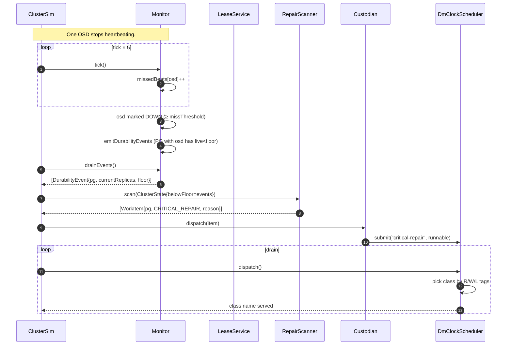

# Repair on Disk Failure

> Last reconciled with the repo on 2026-05-20.
>
> The control-plane response to an OSD going DOWN: heartbeat miss → durability event → Custodian scan → dmClock dispatch → repair work claimed.

## 1. Why this flow exists

A real cluster has disks failing constantly. The architectural choice the wiki argues for is to handle repair via a stateless **Custodian** running outside the foreground placement plane, with per-OSD QoS (**dmClock**) ensuring background work doesn't starve client I/O. This flow is the in-code demonstration of that.

## 2. Sequence

## 3. Step-by-step walkthrough

1. **Five `tick()` calls** advance simulated time past `missThreshold` (3). The miss counter for the failing OSD reaches 5; status flips to DOWN.
   *File:* `dfs-monitor/.../Monitor.java#tick`.

2. **Monitor emits durability events.** Inside `tick`, after status updates, `emitDurabilityEvents` walks the PG map. For each PG, counts UP replicas; if below `durabilityFloor` (default 2), emits a `DurabilityEvent(pg, alive, floor)`. Events accumulate in an in-memory list.

3. **Simulator drains events.** `monitor.drainEvents()` returns and clears the list. The returned events form the input to the scanner.

4. **RepairScanner produces work items.** `scanner.scan(state)`:
   - Each `DurabilityEvent` → `WorkItem(pg, CRITICAL_REPAIR, "below durability floor: ...")`.
   - Items returned sorted by `PriorityClass.ordinal()` — CRITICAL_REPAIR is the lowest ordinal, so always first.
   *File:* `dfs-custodian/.../RepairScanner.java#scan`.

5. **Custodian dispatches each work item.** `custodian.dispatch(item)` maps `CRITICAL_REPAIR` → class name `"critical-repair"` and calls `scheduler.submit(...)` with a runnable that increments a counter (the teaching stub for "actually doing repair").
   *File:* `dfs-custodian/.../Custodian.java#dispatch`.

6. **DmClock chooses a class.** On each `scheduler.dispatch()` call, the scheduler walks the reservation phase first: pick the class with smallest `r` tag whose `r ≤ virtualTime` and whose queue is non-empty. `"critical-repair"` has reservation=100 (set up by the simulator); its `r` tag advances slowly, so it gets dispatched early and often. The actual op runs.
   *File:* `dfs-qos/.../DmClockScheduler.java#dispatch`.

7. **Simulator drains the scheduler.** `while (scheduler.dispatch() != null) ;`. Every queued op runs; `dispatched("critical-repair")` ends > 0.

8. **Simulator heartbeats the failed OSD back.** The scenario closes by calling `monitor.heartbeat(osd)` for every OSD — `missedBeats` resets to 0, status flips back to UP. `isHealthy()` returns true.

## 4. Failure modes

| Step | Failure | Behaviour |
|---|---|---|
| 1 | Tick called too few times | OSD stays UP; no durability events |
| 2 | PG already at floor (1 of 2 surviving) before scenario | first tick after a failure emits the event |
| 3 | Events drained but no scan run | Events lost; no repair |
| 4 | Scanner sees `belowFloor=[]` | Returns empty list; nothing to do |
| 5 | Custodian receives unknown `PriorityClass` | Throws (defensive) |
| 6 | Scheduler class not registered | Throws on submit |
| 6 | Reservation set to 0 on `critical-repair` | Weight phase still picks it up (just less aggressively) |

## 5. The dmClock policy

The simulator wires the four QoS classes with these knobs:

| Class | Reservation | Weight | Limit |
|---|---:|---:|---:|
| critical-repair | 100 | 10 | 1000 |
| routine-repair | 10 | 5 | 1000 |
| scrub | 0 | 1 | 1000 |
| rebalance | 0 | 1 | 1000 |

The high reservation on `critical-repair` is what guarantees it runs ahead of routine work when both have queued ops. The high weight is what gives it most of the excess capacity. The wiki's "auto-elevate recovery when below floor" idea is implicit here — `critical-repair` is *already* the elevated class; routine repair gets a different class name and lower numbers.

## 6. Related

- [`modules/dfs-monitor.md`](../modules/dfs-monitor.md), [`modules/dfs-custodian.md`](../modules/dfs-custodian.md), [`modules/dfs-qos.md`](../modules/dfs-qos.md)
- Wiki: [`patterns/custodian-background-control-plane`](https://github.com/hemantkgupta/CSE-Raw/blob/main/wiki/patterns/custodian-background-control-plane.md), [`concepts/dmclock-qos`](https://github.com/hemantkgupta/CSE-Raw/blob/main/wiki/concepts/dmclock-qos.md)
