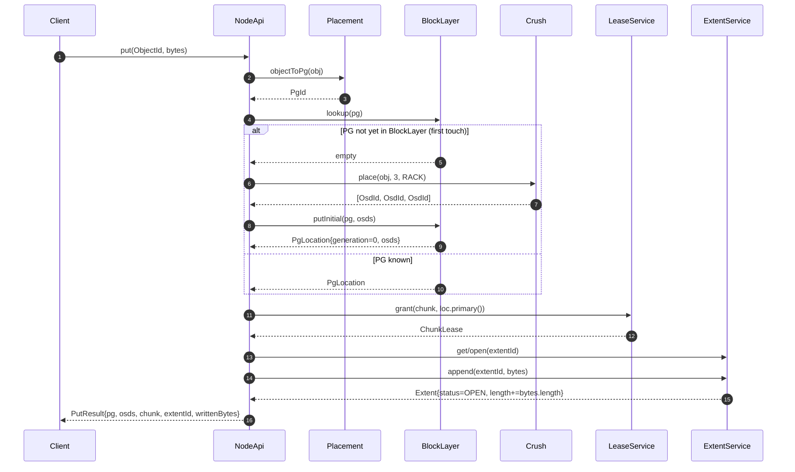

# Write Path — PUT an Object End-to-End

> Last reconciled with the repo on 2026-05-20.
>
> What happens when a client calls `NodeApi.put(obj, bytes)`: the canonical happy-path traversal through Phase 1 modules.

## 1. Why this flow exists

The write path is the smallest meaningful integration in the repo. It shows the hybrid placement pattern in action (CRUSH on first touch, Block Layer lookup thereafter), the chunk lease granted to the primary OSD, and the append into an extent. Every other flow is a variant or failure-mode of this one.

## 2. Sequence

## 3. Step-by-step walkthrough

1. **Client calls `NodeApi.put(obj, bytes)`**. Entry point: `dfs-node/.../NodeApi.java#put`.

2. **Hash the object to a placement group.** `placement.objectToPg(obj)` — FNV-1a hash mod `pgCount`. Pure CPU; no I/O. Determinism property: same `ObjectId` always produces the same `PgId`.
   *Invariant:* the hash function is stable across the lifetime of the cluster.

3. **Lookup the PG's current OSDs in the Block Layer.** `blockLayer.lookup(pg)`. Returns `Optional<PgLocation>`. On hit: skip to step 5. On miss: continue to step 4.

4. **First-touch CRUSH walk.** `crush.place(obj, replicationFactor=3, BucketType.RACK)` returns the deterministic 3-OSD list respecting rack-failure-domain separation. `blockLayer.putInitial(pg, osds)` seeds the lookup table with generation 0.
   *Invariant:* the OSD list returned by CRUSH has exactly `replicationFactor` distinct OSDs, each in a different rack.

5. **Grant a chunk lease to the primary.** `leases.grant(chunk, loc.primary())`. The primary is `osds.get(0)` by convention. The lease expires in 60 s by default and can be renewed.
   *Invariant:* at any time, at most one OSD holds the lease for a given chunk.

6. **Open the PG's extent if not yet open.** The toy extent ID is `"ext-" + pg.value()`. A real cluster has multiple extents per PG that roll over on size or seal.

7. **Append the bytes to the extent.** `extents.append(extentId, bytes)`. The extent's `length` advances by `bytes.length`. Status stays `OPEN`.
   *Invariant:* in this stub, the byte count is recorded; in a real implementation the bytes would also be persisted to the primary OSD and replicated.

8. **Return a `PutResult`.** Records the PG, the OSD list, the chunk ID, the extent ID, and the byte count written.

## 4. Failure modes

| Step | Failure | Behaviour |
|---|---|---|
| 2 | (cannot fail; pure CPU) | — |
| 3 | (BlockLayer is in-memory CHM; cannot fail) | — |
| 4 | CRUSH cannot satisfy replication factor (too few racks) | `IllegalStateException` thrown to caller |
| 5 | Primary OSD already has a lease for this chunk | The new grant overwrites (intentional for failover) |
| 6 | Extent already exists | the try/catch wraps `get` and proceeds; if `open` fails it throws |
| 7 | Extent is sealed | `IllegalStateException` (this stub never seals during put; only via explicit `seal`) |

## 5. Where bytes don't go (stubs)

This flow does NOT exercise:

- **`dfs-storage.Osd`** — the BlueStore-style OSD that would actually receive and persist the bytes.
- **`dfs-erasure`** — the replication/EC scheme that would shard the bytes.
- **`dfs-monitor`** — the cluster monitor that would normally grant the lease (here, `NodeApi` calls `LeaseService.grant` directly).

A real PUT would route through all three. The teaching repo's foundation modules deliberately stop at the extent service so the sequence stays small.

## 6. Related

- [`modules/dfs-node.md`](../modules/dfs-node.md) — the composition
- [`modules/dfs-crush.md`](../modules/dfs-crush.md), [`modules/dfs-placement.md`](../modules/dfs-placement.md), [`modules/dfs-lease.md`](../modules/dfs-lease.md) — each Phase 1 module
- [`architecture.md`](../architecture.md) — the module dependency graph
- Wiki: [`patterns/hybrid-deterministic-lookup-placement`](https://github.com/hemantkgupta/CSE-Raw/blob/main/wiki/patterns/hybrid-deterministic-lookup-placement.md)
